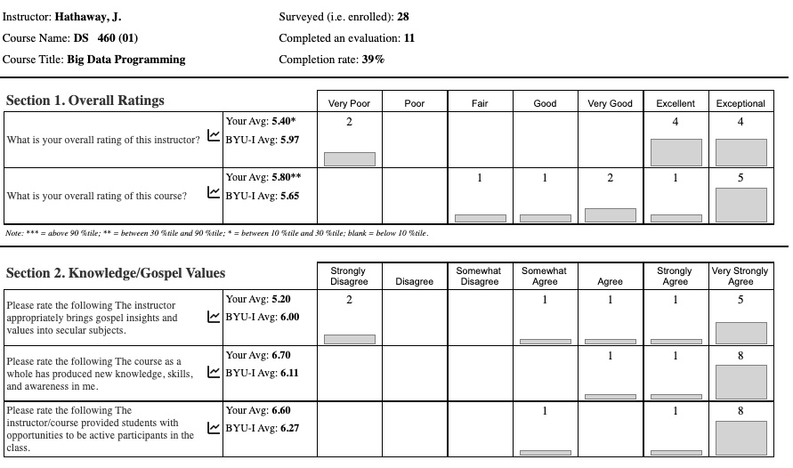

# Course Feedback

## Learning should 'burn' a little. Yes confusion is a good thing.

> The concept of optimal confusion is key to understanding why confusion is good for us and why its categorized as an epistemic emotion-an emotion critical to knowledge acquisition and learning. It turns out that confusion, like many uncomfortable things in life, is vital for learning. According to research, confusion has the potential to motivate, lead to deep learning, and trigger problem solving. A study led by Sidney D’Mello found that when were trying to work through our confusion, we need to stop and think, engage in careful deliberation, develop a solution, and revise how we approach the next problem.

__[See short post for reference](https://educate.datathink.io/posts/desirable-difficulty/)__

## Student Feedback (with my commentary)

### Student 1

> One thing that was really hard was the total blindness I felt almost the entire semester. I get that that was kind of the point, but it really was hitting a brick wall all semester. I think it affected everyone in the class's hours in one of two ways: either they felt totally lost so didn't put in any hours, or they felt like they had to work extra hard to make any progress at all and went way overboard. I'm in the latter category. I think making the end goal a little less foggy earlier would be a good thing for everyone. __Spring 2022 Student__

- __Fantastic comments:__ _The feeling described is what we need to get comfortable experiencing. Open-ended problems have this issue. Remember, the class decides the end goal. Not me._

> I didn't appreciate working for hours on something, and then having the direction of the class upended on me, rendering all my work useless. It was frustrating and discouraged me from working on things until the last second in case they were changed on me at the last second. __Spring 2022 Student__

- __My response:__ _This element was a crucial part of the class. You should have had enough space to make your ideas what we used as a class. Make sure to take the time to build your communication so we all see how your vision is optimal._

> My favorite part about the course was the design thinking principles that were implemented that allowed us as a class to decide what we wanted to learn. I also really enjoyed the final, specifically learning how to use GraphQL API. I also enjoyed learning about spark and to have an opportunity to practice my Scala skills. At times the class was confusing with deadlines and expectations of the class. For me, that is what I disliked the most about the class was the occasional confusion with expectations. __Spring 2022 Student__

- __I know:__ _Seeing a theme in the above three. The class is a work in progress. We continue to find the balance between teacher skills, student skills, and how far we can push the start-up analogy into a three-month classroom setting._

> Something I enjoyed about the class was how open-ended the course was. I think this allowed for greater collaboration that cannot be accomplished in the traditional sit and lecture format. __Spring 2022 Student__

- __Remember:__ _Your class defines the project vision. As the teacher, I have some technical learning objectives we need to complete. Collaboration and communication are key learning outcomes._

> Overall, I enjoyed the class. I liked that the solution changed over time (I feel like that reflects how problem-solving usually goes), and that we learned more than PySpark (i.e., streamlit, docker, etc.). I enjoyed the free flow of the class and the freedom to express thoughts and ideas. I think that the course would benefit from a little more structure when learning technical skills. __Spring 2022 Student__

- __Agreed:__ We continue to improve the structure around the technical skills. However, we are pushing the boundaries on this topic as well. We invite you to think of your instructor as an expensive consultant ($300-$500 an hour) that you want to leverage on elements of the programming that you can't quite figure out on your own.

### Student 2

> I think the intentional lack of rigid structure is a great mechanism for growth. I personally feel much more prepared for a real work environment after this class than any other class. Students who find this type of class frustrating seem to be the same students who would find dynamic work environments frustrating and should probably find a job where they are just told what to do and not have to worry about the independence and agency as much.

- __Agreed:__ This student took control of their learning experience.  Please note that the class sets the direction in consultation with me.  I want you to feel what it means to have indepence and agency with high expectations.

### Student 3

> Brother Hathaway is the WORST professor Ive ever had. Each class he would tell us, figure it out. The more advanced students would and then he would yell at the rest of the class calling us failures because we arent as advanced as the #1 student. To top it all off, he didnt teach. He had us do it, then gets mad when we don’t completely understand.

- __Life is a journey:__ Well, 'WORST' is pretty intense. I think this student was actually an advanced student. At least he earned an A. He and his team earned my negative attention because of their work not because of other student's work. This class is built for the 'teacher' to work as a manager and mentor. It is worth reviewing the differents between mentors and teachers as [described here](https://mentorcruise.com/blog/whats-difference-between-teacher-vs-mentor/#:~:text=A%20teacher%20provides%20knowledge%20and,guide%20you%20through%20your%20vision.). 
    - _"Mentorships are based on a mentor’s effective guidance of the mentee’s growth, whether professional or personal. As such, this is hard to quantify and is largely based on how the mentee decides to proceed following the mentor’s advice. On the other hand, a teacher instructs you on a subject matter based on a set of predefined criteria. Most of the time, the main goal of a teacher is to make sure that their students get great grades."_
    - _"The mentor wills the mentee to self-discipline. The teacher instills learning through authority."_

### Student 4 (While in their internship after the class)

> Hey Bro. Hathaway. Just want to say I learned a ton from your class last semester that I am now using at my internship in data engineering at XXXXX.

- __Mimicking:__ I am doing all I can to mimic work not school. I would love to hear from many of you about how this class supported you while in the workforce.

### Student 5 (While taking the class)

> Brother Hathaway knows an incredible amount about the field. However, he is blatantly disrespectful to students, teaches false doctrine based on opinions, and acts as if he is the leading expert on every subject. If you try to question or challenge him he will ridicule you in front of the class rather than try to teach you in a dignified manner.

- __Apology:__ I don't every want to be percieved as one that ridicules. If you feel this way, please come talk to me one-on-one. I also don't want to be disrespectful. However, I do have very high expectations and will communicate shortcomings.
- __Leading Expert:__ I don't think I am a leading expert on many subjects. I think this student got a little frustrated one day in class when we were talking about dieting. He was the thin one and I was the fat one. Maybe he was right.
- __False Doctrine:__ I found this comment amusing. I have made a concerted effort to share my faith in the first five minutes of class over the last few semesters. I enjoy the banter with you as we talk about more complicated elements of our theology. 

For reference you can see the scoring of my Fall 2022 course (I bet the above review was from one of those two `Very Poor` and `Strongly Disagree` students).

