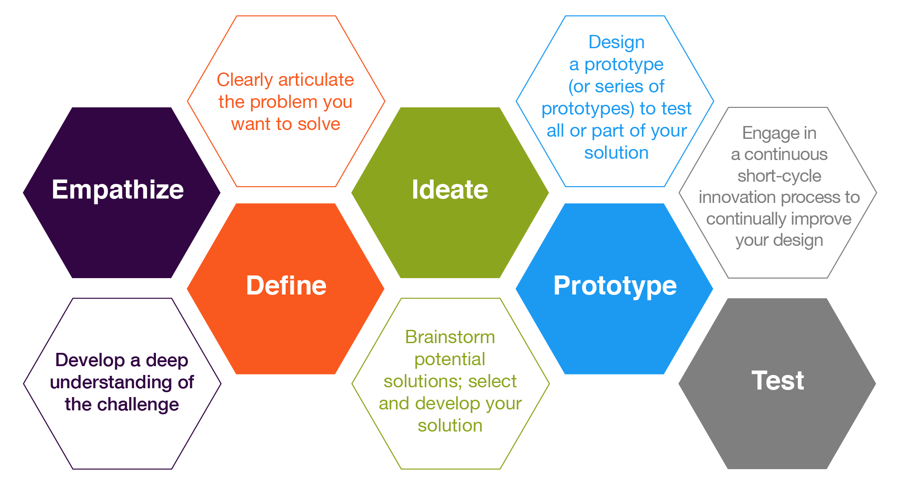
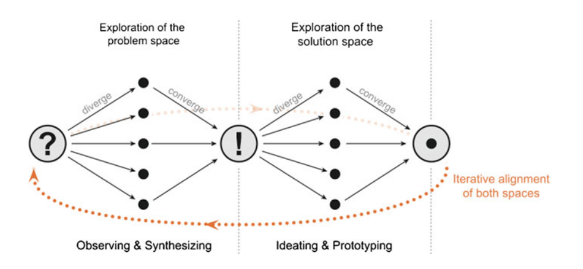
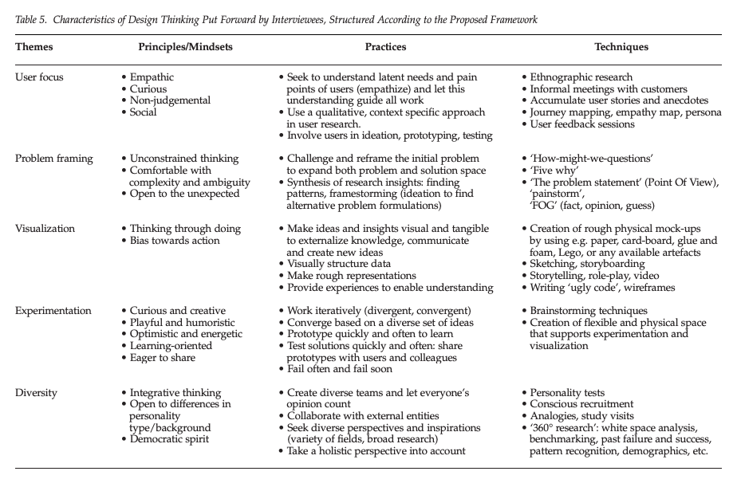

# Design Thinking, Agile Methods, and Data Science

> Most outsiders see design as an applied art, as having to do with aesthetics, unlike a solid profession unto itself, with technical knowledge, skills, and responsibilities to rely on. Insiders to design, by contrast, talk of innovative ideas, coordinating the concerns of many disciplines, being advocates for users, and trying to balance social, political, cultural,
and ecological considerations.
> Klaus Krippendorf (2006, 47)

_[Source](https://www.flickr.com/photos/edrethink/33566499814/in/photostream/)_

__[Reading for class](DT-IT.pdf)__

## The Design Thinking Diagrams

_[Source](https://citl.illinois.edu/paradigms/design-thinking)_

_[Source](https://www.stephaniebaseman.com/design-thinking-process)_

_[Source](https://www.maqe.com/insight/the-design-thinking-process-how-does-it-work/)_

_[Source](https://link.springer.com/chapter/10.1007/978-3-642-13757-0_1)_

_[Source](https://onlinelibrary.wiley.com/doi/10.1111/caim.12153)_

### Design Thinking in Practice

- [ABC Nightline: IDEO Shopping Cart](https://www.youtube.com/watch?v=M66ZU2PCIcM)
- [IDEO and a Story of Design](https://www.youtube.com/watch?v=_KK958OkD6g)

## Agile Data Science

> The basic idea behind agile is to manage IT development not by rigid milestone-based process roadmaps that the team has to follow, but by a set of obligatory rules and roles in which the team can act flexibly in order to sustain learning about the project and adaptability to unexpected events. The requirement analysis is not a preceding step, but a parallel process to the actual development.  ... short iterative steps while the goal of each step is to produce an incremental intermediate solution that serves to generate feedback by users and specialists.
> [Source](https://link.springer.com/chapter/10.1007/978-3-642-13757-0_1)

### Agile DS Manifesto

Russell Jurney provided some [Agile guidelines for data science projects](https://www.oreilly.com/radar/a-manifesto-for-agile-data-science/) that resonates;

1. __Iterate, Iterate, Iterate:__ _In data science, iteration is the essential element to the extraction, visualization, and productization of insight. When we build, we iterate._
2. __Ship intermediate output:__ _Good systems are self-documenting, and in Agile data science, we document and share the incomplete assets we create as we work. We commit all work to source control. We share this work with teammates and, as soon as possible, with end users._
3. __Perform experiments, not tasks:__ _Managing a data science team means overseeing multiple concurrent experiments more than it means handing out tasks._
4. __Listen to the data:__ _The data’s opinion must always be included in product discussions, which means that they must be grounded in visualization through exploratory data analysis in the internal application that becomes the focus of our efforts._
5. __Respect the data-value pyramid:__ `plumbing > clean and question > explore and summarize > Infer and predict > deliver and drive value`
6. __Find the critical path:__ _A product manager cannot manage this process from the top down; rather, a product scientist must discover it from the bottom up._
7. __Get meta:__ _We can’t easily ship good product assets on a schedule comparable to developing a normal application. As we document the analytics process and iteratively climb the data-value pyramid to pursue the critical path to a killer product our Agile deliverables are intermediate content._

### Comparing Agile to DS

> In comparison with design thinking, agile shows some strong parallels: core features like “user-centricity”, “iterative learning and development processes”, and “extensive team communication” seem to suggest that design thinking methodology has been already introduced to IT development. On closer examination, however, one can see crucial differences. __Primarily, agile rather concentrates on continuous incremental refinements than on exploring and comparing radically new solution paths.__
> [Source](https://link.springer.com/chapter/10.1007/978-3-642-13757-0_1)

## Notes

See the [notes](notes.md) for other references that could be of value. You can look over the [a curated list of design thinking resources](https://byuidesignthinking.github.io/course_guide/readings/readings_table.html) to review more material on design thinking.