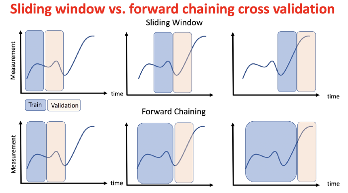

# Creating Features for ML

## Feature creation overview

- [Best Practices for Feature Engineering](https://elitedatascience.com/feature-engineering-best-practices)
- [How to create useful features for Machine Learning](https://www.dataschool.io/introduction-to-feature-engineering/)
- [Want to Ace Data Science Hackathons? This Feature Engineering Guide is for you](https://www.analyticsvidhya.com/blog/2020/06/feature-engineering-guide-data-science-hackathons/)

## Time series data

Most analysts will make mistakes in evaluating and fitting time series models if they don't have previous experience in this space. I recommend that you read the below references to understand some of the issues. If you would like to leverage your standard tools for machine learning, you can use a [sliding window or forward chaining](https://towardsdatascience.com/time-series-machine-learning-regression-framework-9ea33929009a). However, we will still need to be careful with our validation process.

Jason Brownlee [provides some clear examples for our data formatting](https://machinelearningmastery.com/time-series-forecasting-supervised-learning/#:~:text=The%20use%20of%20prior%20time,or%20size%20of%20the%20lag.) that may help. I especially like the following image to visualize the windowing concept.

## References

### Time series

- [Fine-Grained Time Series Forecasting at Scale With Facebook Prophet and Apache Spark: Updated for Spark 3](https://databricks.com/blog/2021/04/06/fine-grained-time-series-forecasting-at-scale-with-facebook-prophet-and-apache-spark-updated-for-spark-3.html)
- [How (not) to use Machine Learning for time series forecasting: Avoiding the pitfalls](https://towardsdatascience.com/how-not-to-use-machine-learning-for-time-series-forecasting-avoiding-the-pitfalls-19f9d7adf424)
- [How (not) to use Machine Learning for time series forecasting: The sequel](https://www.kdnuggets.com/2020/03/machine-learning-time-series-forecasting-sequel.html)
- [ML Approaches for Time Series](https://towardsdatascience.com/ml-approaches-for-time-series-4d44722e48fe)
- [Time Series Machine Learning Regression Framework](https://towardsdatascience.com/time-series-machine-learning-regression-framework-9ea33929009a)
- [rapidminder video: Using Windowing on Time Series Data](https://academy.rapidminer.com/learn/video/using-windowing-on-time-series-data)
- [Cross Validation in Time Series](https://medium.com/@soumyachess1496/cross-validation-in-time-series-566ae4981ce4)
- [Using k-fold cross-validation for time-series model selection](https://stats.stackexchange.com/questions/14099/using-k-fold-cross-validation-for-time-series-model-selection) which has two referenced articles about using k-fold over forward chaining validation.
- [Flint: A Time Series Library for Apache Spark](https://github.com/twosigma/flint)
- [Fine-Grained Time Series Forecasting At Scale With Facebook Prophet And Apache Spark](https://databricks.com/blog/2020/01/27/time-series-forecasting-prophet-spark.html)

