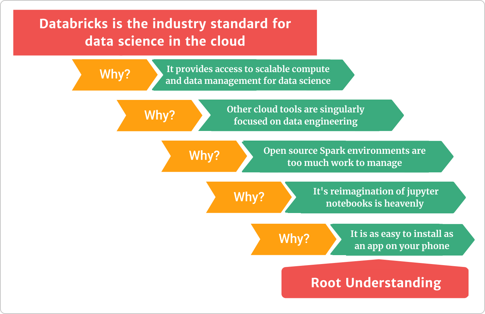

# On informal small group presentations

Don't read _informal_ as sweats and lack of preparation. You should be dressed to the group's standard and prepared. You may need to be more technically prepared than you would be for a _formal_ presentation. [TED Talks](https://www.ted.com/) are powerful, organized, and concise. They take a lot of time to polish. However, the audience doesn't interact and often isn't as technically capable as those to whom you present in a small group presentation. __TED Talks are symphonies, and small group presentations are live Jazz.__

## Be prepared for depth questions

Your small audience is full of people that care about the problem you are presenting. They often have decades of experience with the material you are offering. You should be prepared to go deep on different topics at a moment's notice. Here are a few key points to help you with the depth.

- Practice a version of [five whys](https://kanbanize.com/lean-management/improvement/5-whys-analysis-tool) to get to the more profound questions that may be asked during your presentation
- You must be able to answer almost any question about the data source you are using
- Make sure your audience understands the data sources behind the data summaries.
- Your methods, code, and approach should be summarized, but you should be prepared to go in-depth on any element.

## Make your point early and then justify

Small groups presentations can move all over the place. If you have a solid point to make, then make it early to get everyone on the same rhythm (remember that live Jazz analogy), and then justify that argument with your remaining time. Let the team questions add to the rhythm that you established.

## Clear communication is critical

Don't forget that you have more experience with your presentation material. You have to set the groundwork with clear narratives and visualizations.  

- Poor visualizations with imperfect labels or that are hard to read hurt your communication
- Make sure to provide the background needed to get your point across
- Think about the arch of your pitch

## Additional Reading

- [Supercompetent Speaking: Presenting to Small, Elite Groups](https://trainingmag.com/supercompetent-speaking-presenting-to-small-elite-groups/)
- [One on One: Presentation Tips for Small Groups](https://www.presentationtraininginstitute.com/one-on-one-presentation-tips-for-small-groups/)
- [Simple Group Presentation Tips for Maximum Teamwork Magic](https://24slides.com/presentbetter/simple-group-presentation-tips)
- [Planning and Presenting in Small Groups](https://us.sagepub.com/sites/default/files/chapter_18_gamble_the_public_speaking_playbook_3e_0.pdf)
- [5 Whys: The Ultimate Root Cause Analysis Tool](https://kanbanize.com/lean-management/improvement/5-whys-analysis-tool)